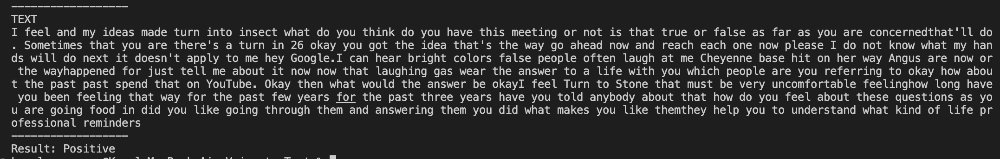

# Speech Sentiment Analysis

This program splits audio files into chunks and converts each chunk into text, performing sentiment analysis. The sentiment analysis determines whether the text is positive, negative, or neutral.

## Installation

First, you need to install some libraries for the program to work.

- **Google Cloud SDK**: You can download it from [here](https://cloud.google.com/sdk/docs/install) to use Google Cloud APIs.
- **pydub**: Used for audio processing. You can install it using the following command:

    ```bash
    pip install pydub
    ```

- **textblob**: Used for text analysis. You can install it using the following command:

    ```bash
    pip install textblob
    ```

- **google-cloud-speech**: Used to utilize the Google Cloud Speech-to-Text API. Install it with the following command:

    ```bash
    pip install google-cloud-speech
    ```

Additionally, you need to save your Google Cloud API credentials (in JSON format) in a file named `credentials.json`.

## Usage

1. Prepare an audio file named `voice.wav` and place it in the same directory as the program.

2. Run the program using the following command:

    ```bash
    python main.py
    ```

3. The program splits the audio file into chunks at specified durations, converts each chunk into text, and performs sentiment analysis. The resulting sentiment (positive, negative, or neutral) of the text is printed to the console.

4. Additionally, the full text variable (`text`) containing the concatenation of all transcripts is printed to the console.

## Example 



## License

This project is licensed under the MIT License. For more information, please see the [LICENSE](LICENSE) file.

---

This example demonstrates the usage of a Python program that splits audio files into chunks, converts them into text, and performs sentiment analysis. You can customize and enhance the program according to your needs.

Please note that you need a Google Cloud account and API credentials for the program to work correctly. Refer to the Google Cloud documentation for instructions on using their APIs.

If you have any questions or need further assistance, please feel free to contact me.

